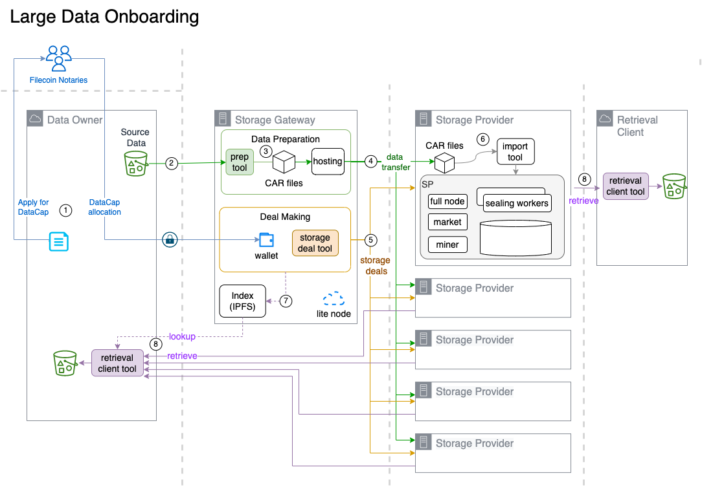

# 📐 Reference Architecture

## Data pipeline

The following is the reference architecture prescribed in this guide to onboard large data sets.&#x20;

<figure><figcaption>
Large data onboarding pipeline with storage gateway
</figcaption></figure>

The outline of data onboarding steps (numbered circles) as follows:

1. Data Owner applies for Datacap, to be allocated to the client wallet.
2. Gateway fetches source dataset.
3. Gateway prepares source dataset into **C**ontent-addressable **AR**chive ("CAR") formatted files.
4. Storage Providers ("SPs") downloads CAR files
5. Gateway proposes storage deals to SPs.
6. SPs imports the CAR files corresponding to Storage Deals. Seals the data into sectors.
7. Create an index for each dataset.
8. Browse and Retrieve files from the dataset.&#x20;

### Storage Gateway

The "_Storage Gateway_" is a client-facing function responsible for data preparation, coordination with and deal-making with participating SPs. The organization running the storage gateway may recommend participating SPs based on individual client requirements.

The _Storage Gateway_ function can be operated by any of the following:

* the _Lead Storage Provider,_\
  __The client onboarding experience is managed by a _Lead SP._ The lead SP serves as an advisor to the client, and performs data onboarding as a service for the Data Owner. This is currently the most common path.
* the _Data Owner_,\
  When the data owner organization wants to take control of the onboarding process, and have the required technical skills and resources.
* an _independent_ _service provider_\
  __Storage gateway services may be potentially be provided by ISV, SaaS, and other service providers.&#x20;

With the complexities involved with tooling, coordination, and large dataset data transfer, it is generally recommended for Data Owners to nominate a Lead Storage Provider to handle data onboarding tasks on their behalf.

###
